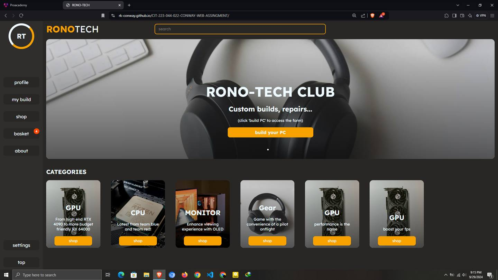
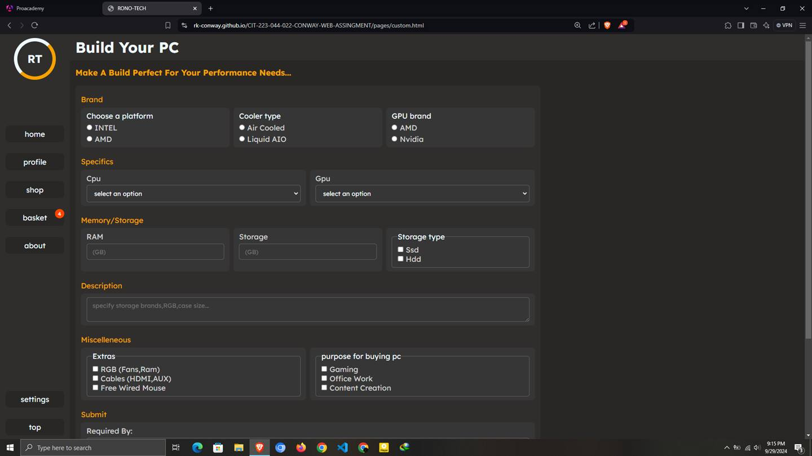
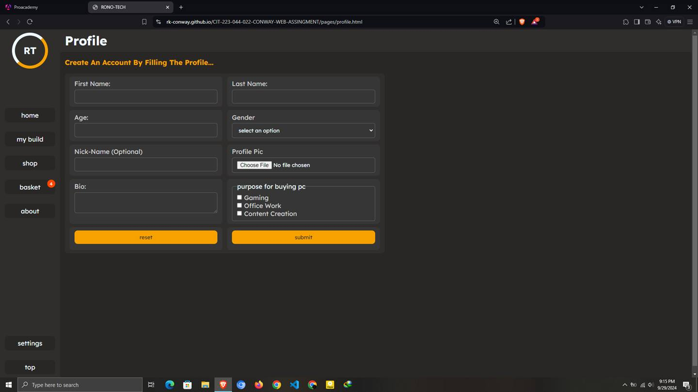

# webdev 2 assignment

## About the website  
This an e-commerce and PC tech enthusiast forum.  

For gammers, productivity a  ddicts and IT or office professionals looking for highly performant desktop computers.  
With a wide collection of PC components to suit every budget and need.  
We also offer consultancy and repair services to customers, and a forum where one can create a profile and engage in discussions with other community members.  

Here is the link to the site(try out the basket feature that uses local storage)...
[Live page: github hosted](https://rk-conway.github.io/CIT-223-044-022-CONWAY-WEB-ASSINGMENT/pages/about.html)  

Here are some images:  

# Home page  
  

# Form for making a custom build  
  

# Profile form  

